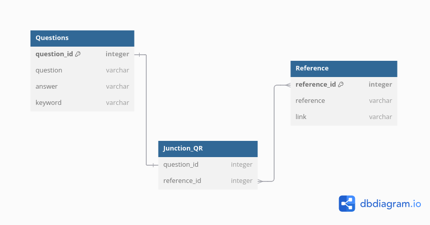
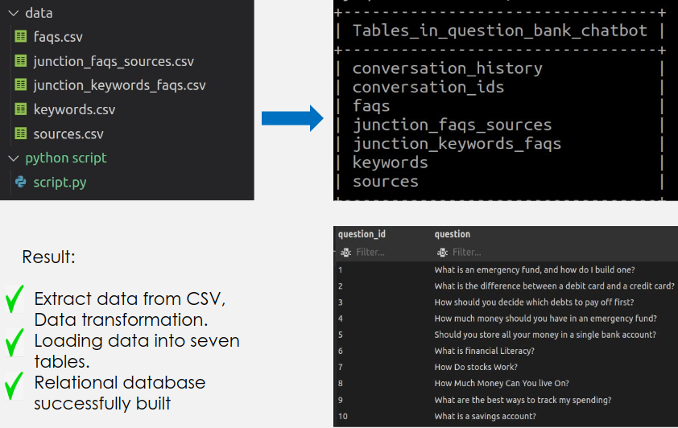

# AI_chatbot_project

## Project Overview
AIFinancialChatbot is an AI-powered chatbot designed to provide financial advice and answer frequently asked questions (FAQs) about finance. The chatbot uses a structured database to deliver accurate responses, track user interactions, and manage financial-related queries effectively.

The project was divided into three development sprints, where each sprint contributed to enhancing the database structure, preparing the data, and automating the data integration process.

## Database Development

### Sprint 1: Initial Setup
- **Task**: Create a bank of 50 frequently asked questions (FAQs) about finance.
- **Actions**:
  - The FAQs were stored in Google Sheets, with additional references and keywords for each FAQ.
  - The initial database schema was designed, consisting of the following tables:
    - `faqs`
    - `sources`
    - `junction_faqs_sources` (a junction table to link FAQs with their sources)
- **Output**: This schema was shared with developers, who requested tracking user conversations, leading to schema updates in Sprint 2.



### Sprint 2: Schema Normalization & Conversation Tracking
- **Task**: Expand the schema to handle user interaction tracking and improve table normalization.
- **Actions**:
  - Added new tables:
    - `keywords`
    - `junction_faqs_keywords` (links FAQs to keywords)
    - `conversation_history` (stores user conversations)
    - `conversation_id` (stores conversation session data)
  - Manually implemented the database in MySQL, with 10 sample records in each table for testing purposes.
- **Output**: Shared the updated schema and populated database (50 FAQs, references, keywords) with the development team.
.png>)
### Sprint 3: Automation and EC2 Deployment
- **Task**: Automate the database creation and population using scripts.
- **Actions**:
  - Exported Google Sheets data to CSV files.
  - Deployed the CSV files to an Amazon EC2 instance.
  - Created a Python script utilizing `pandas`, `SQLAlchemy`, and `mysql.connector` to:
    1. Create the database and user.
    2. Load CSV data into `pandas` DataFrames.
    3. Create tables in MySQL using `mysql.connector`.
    4. Populate the database using `SQLAlchemy`.
  - Executed the script on the EC2 instance to create and populate the database.
- **Output**: Fully automated database setup, ready for integration into the chatbot.

## Database Schema

The final schema includes the following tables:
- **`faqs`**: Stores FAQ data.
- **`sources`**: Stores reference sources.
- **`keywords`**: Stores associated keywords.
- **`junction_faqs_sources`**: Junction table linking FAQs and sources.
- **`junction_keywords_faqs`**: Junction table linking FAQs and keywords.
- **`conversation_history`**: Logs user interactions, with a composite primary key (`conversation_id`, `created_at`).
- **`conversation_id`**: Stores conversation sessions, linked to `conversation_history`.

## Python Script (Automated Setup and Data Insertion)
The Python script automates the creation of the database and the insertion of data from CSV files. Below is an overview of the script. The full script is available in the /python_script/script folder.

```python
import mysql.connector
import pandas as pd
from sqlalchemy import create_engine
```

